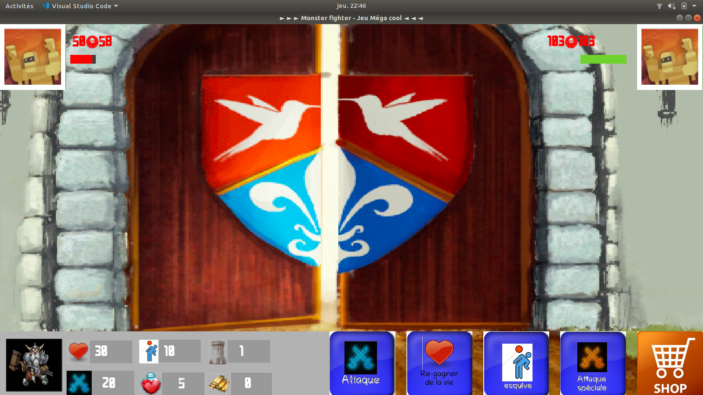

# Monster-fighter
<div align = "center">
 :octocat: :+1:|<a href="#cest-quoi-monster-fighter-"> C'EST QUOI </a>
 |<a href="#Pour-commencer"> POUR COMMENCER </a>
 |<a href="#Commandes"> COMMANDES </a>
 |<a href="#Explications-de-choses-incompréhensible"> INCOMPREHENSIBLE </a>
 |<a href="#à-propos-de-linterface-graphique
"> À PROPOS</a>
 |<a href="#des-touches-permettant-dacheter"> TOUCHES POUR ACHETER </a>
 |<a href="#Des-règles-à-venir"> À VENIR </a> 
 |<a href="#screenshot"> SCREENSHOTS </a>| :+1: :octocat:
 </div>

## C'est quoi monster-fighter ?
C'est un jeu où tu combats des monstres. Pour monter d'étage en étage il faut que tu battes des monstres, en utilisant des objets achetés à la boutique, en attaquant tout simplement, en faisant une attaque spécial etc.

<br/>
<div align = "right">
    <b> <a href="#----"> ↥ haut de page </a> </b>
</div>
<br/>

### Pour commencer
- Pour lancer le jeu voila ce qu'il faut faire :
    
    1. Installer __```python```__ 

    2. Installer __```pygame```__

    3. Deux choix:
        1. Clonner le repesitory:
        ```bash
        $ git clone https://github.com/tabegon/monster-fighter.git
        ```

        2. télécharger le zip

    4. Ouvrez le jeu et jouez

    5. Allez dans <b> <a href="#Commandes"> Commandes </a> </b>

<br/>
<div align = "right">
    <b> <a href="#Monster-fighter"> ↥ haut de page </a> </b>
</div>
<br/>

### Commandes
- Je n'ai pas beaucoup de choses à dire à se sujet car dans le jeu les commandes y sont déjà :
    - L'attaque spéciale peut être utiliser que 2 fois à part si tu achète des boules de pouvoirs
    - les commandes permettant d'acheter:
        - <kbd>a</kbd> = attaque
        - <kbd>s</kbd> = attaque spéciale
        - <kbd>e</kbd> = esquive
        - <kbd>r</kbd> = régénération
        - <kbd>*</kbd> = pomme d'or (+10 pour le maximum de vies)

<br/>
<div align = "right">
    <b> <a href="#Monster-fighter"> ↥ haut de page </a> </b>
</div>
<br/>

### Explications de choses incompréhensible
- Il y a rien d'incompréhensible vous devrai m'en faire remarquez des choses incompréhensible

<br/>
<div align = "right">
    <b> <a href="#Monster-fighter"> ↥ haut de page </a> </b>
</div>
<br/>

## Gui

### À propos de l'interface graphique
- Des choses à faire
    - Il y a encore beaucoup de bugs à réparer donc ne vous attendez pas as un jeu bien dévellopper:
        - [ ] si vous touchez à un endroit ou il y a un métier ça mettra le nouveau métier
        - [ ] parfois le script ne marche pas
        - [ ] tout le temps sur la musique ça fait un "bip"
        - [ ] le texte de ton status s'enlève et se remet à chaque fois
    - On a aussi des choses à ajouter (très beaucoup) :
        - [X] boutique
        - [X] barre de vies
        - [ ] deux monstres
        - [ ] Des mondes
        - [ ] des fonds
        - [ ] Jeu multijoueur (max 2)
        - [ ] boss
        - [ ] des alliés
        - [ ] de nouvelles attaque
        - [ ] et plein d'autres choses

<br/>
<div align = "right">
    <b> <a href="#Monster-fighter"> ↥ haut de page </a> </b>
</div>
<br/>

### des touches permettant d'acheter
- <kbd>a</kbd> = attaque
- <kbd>s</kbd> = attaque spéciale
- <kbd>e</kbd> = esquive
- <kbd>r</kbd> = régénération
- <kbd>*</kbd> = pomme d'or (+10 pour le maximum de vies)

<br/>
<div align = "right">
    <b> <a href="#Monster-fighter"> ↥ haut de page </a> </b>
</div>
<br/>

### Des choses à savoir
- il faut être patient si vous ne voulez pas que quand vous avez peu de pv vous attaquez

<br/>
<div align = "right">
    <b> <a href="#Monster-fighter"> ↥ haut de page </a> </b>
</div>
<br/>

### Des règles à venir
- quand il y a deux monstres utiliser <kbd>1</kbd> pour attaquer le premier monstre ou <kbd>2</kbd> pour attaquer le duxième monstre. Et si vous appuyer sur le bouton <kbd>attaque</kbd> alors vous attaquerai automatiquement le premier monstre.

- dans le duxieme monde appuyer sur <kbd>&uarr;</kbd> pour emprunter le chemin du haut, <kbd>&darr;</kbd> pour le chemin du haut, <kbd>&rarr;</kbd> pour le chemin de droite et <kbd>&larr;</kbd> pour le chemin de gauche.

<br/>
<div align = "right">
    <b> <a href="#Monster-fighter"> ↥ haut de page </a> </b>
</div>
<br/>

### Screenshot
<br/>
<div align = "right">
    <b> <a href="#Monster-fighter"> ↥ haut de page </a> </b>
</div>
<br/>

Voici des screenshots


Sans le shop



***
```markdown
# Bon alors ça vous plait. oui!... Ben alors qu'est ce que vous attendez c'est maintenant. 
```
___OK___

***
***
```markdown
# Crée et développé par Théo Abegon et aider par Marc Abegon. Merci pour tous.
```  
***
